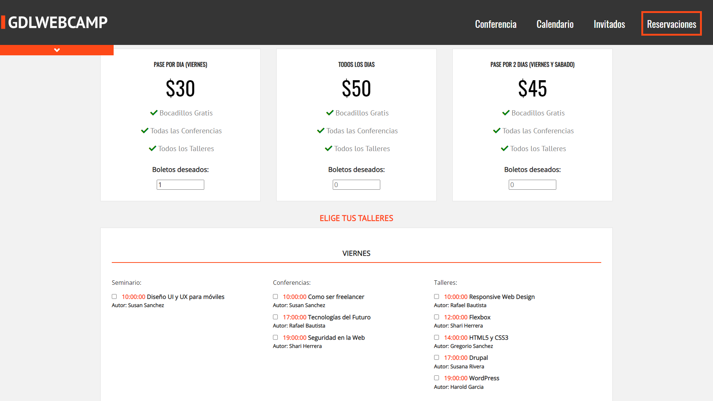
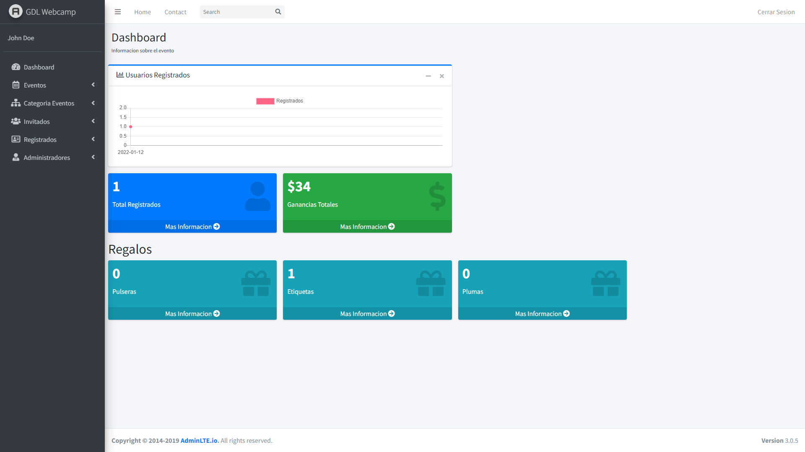

<h1 align="center">GDL Webcamp</h1>

---

  &nbsp
  &nbsp
  &nbsp
  &nbsp
  &nbsp
  &nbsp

## Descricpión

GDL Webcamp es el proyecto final del curso [Desarrollo Web Completo](https://www.udemy.com/course/desarrollo-web-completo-con-html5-css3-js-php-y-mysql/) en Udemy.

Es el sitio web de un evento de conferencias de diseño web y desarrollo web el cual se compone de dos partes:

- Pagina web informativa
- Sistema de administración del contenido de la página y registros al evento

## Página Web

Contiene:

- Página principal informativa del evento
- Galería de fotos
- Agenda del evento
- Invitados
- Sección para adquirir los boletos al evento

  

## Sistema administrativo

Contiene:

- Dashboard con información general de los registros al evento
- Secciones para visualizar, crear, editar y borrar:
  - Eventos
  - Categorías
  - Invitados
  - Registrados
  - Administradores

  

## Conocimientos adquiridos y habilidades puestas en practica

🔹 Posicionamiento con Flexbox \
🔹 Transiciones con CSS \
🔹 Librerías con JQuery \
🔹 Interacciones con Javascript \
🔹 Validación de formularios \
🔹 Envio de datos al servidor \
🔹 Uso de sesiones en PHP \
🔹 Creación de la base de datos \
🔹 Consulta y obtención de datos de la base de datos \
🔹 Implementación del SDK de PayPal \
🔹 Despliegue del sistema a un host

## Uso

### Requisitos

### Instalación
